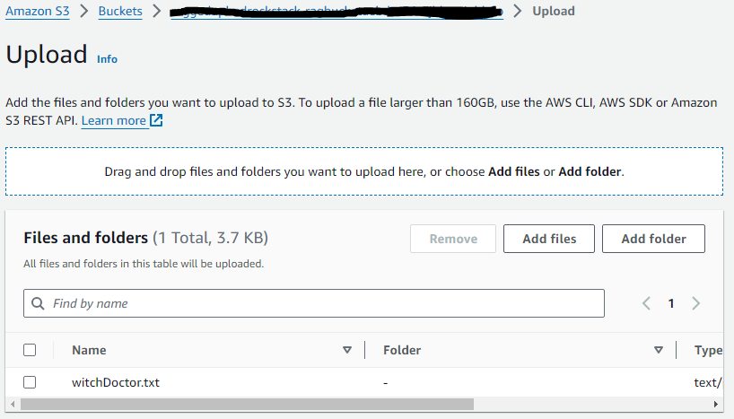

# An example of Retrieval Augmented Generation (RAG) using AWS Bedrock.
This example demonstrates how AWS Bedrock can be used for RAG and exposed as an API.  

This project is developed using AWS CDK in TypeScript.

## RAG Architecture
Retrieval Augmented Generation (RAG) Architecture.

## What does it build?
* Creates an AWS Lambda function that interacts with AWS Bedrock
* Creates an S3 Bucket for document storage
* Creates an AWS Lambda function that loads a document from S3 (Using S3 events) and makes it available to the GenAI Model for RAG.
* Uses Amazon Titan Embeddings G1 - Text model for parsing document
* Uses AWS OpenSearch as a Vector Database -- `Note: please check the OpenSearch pricing to limit your cost.`
* Uses Anthropic's Claude 3 Sonnet model for chat
* Creates an AWS API Gateway endpoint to expose the API

## Steps to run and test
* Deploy the CDK code. Wait for the deploy to finish.  It will print out the API endpoint for you to use.
  * 
* Upload the provided document to the S3 bucket.  I have used a fictitious company and some basic information using the llama-2-70b model to generate this document.
  * 
* Rerun the API call after the document is processed.
  * ")

## References
* Learn about [AWS Bedrock](https://aws.amazon.com/bedrock/)
* AWS Bedrock [Foundation Models](https://docs.aws.amazon.com/bedrock/latest/userguide/models-supported.html)
